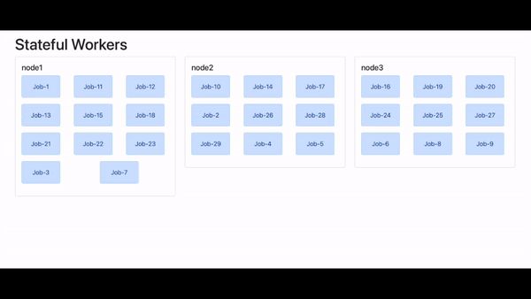
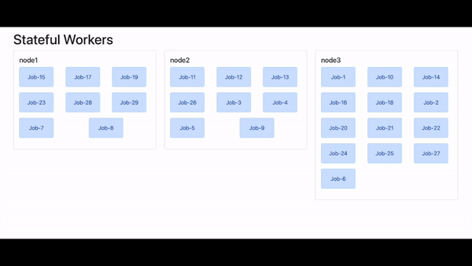

# Go Utilities for Distributed Programming

This package contains utilities to help create stateful distributed software.

Use Case:
* We have a service that is either entirely stateful or has one or many parts that are.
* In other words, these parts should only ever have one instance running at a time.
* The goal is to maximize availability in the face of planned or unplanned disruptions.
* It should be possible to start multiple service nodes; but each stateful section should ever only be running on one node.
* As a side-benefit, if there are multiple stateful parts, they get load balanced across the nodes.
* We have an etcd cluster that we can leverage for leadership election.

Solution:
* Allow multiple service nodes to start up.
* The service registers itself for work and waits on being elected leader.
* Once granted it performs work; but only within the context of it's leadership that it monitors.
* If leadership is lost for whatever reason, it stops working and reverts to campaigning for leadership.

Rolling restart demo:
* 3 nodes are executing 29 stateful jobs.
* Node 1 is restarted. Followed by Node 2, then Node 3.
* Notice the jobs migrating between nodes instantly.



Load balacning demo:
* 3 nodes are executing 29 stateful jobs.
* Random resignation timeouts are configured that allow jobs to move between nodes.
* In steady state, the jobs are evenly distributed.



Code:
* The simplest way to leverage the library is via the framework
* The LeaseProvider is pluggable. Currently only etcd is supported; but more may be added or you can write your own.
```go
provider := distributed.NewETCDLeaseProvider([]string{etcdURL})
p := distributed.NewLeadershipBasedJobProcessor(appName, instanceName, provider, nil)

p.AddJob(distributed.Job{Name: "jobA", Work: jobFor("jobA")}) // portion of the code that is stateful
p.AddJob(distributed.Job{Name: "jobB", Work: jobFor("jobB")}) // portion of another stateful block

if err := p.Execute(ctx); err != nil {
	log.Fatal(err)
}
```

To help with load-balancing, two options are available:
* Adding a start delay - this is a function that can return a randomized delay before leadership election starts
* Voluntary resignation timeout - another function, return a randomized timeout at which point leadership is voluntarily terminated
```go
startDelay := func(string) time.Duration {
	return time.Millisecond * time.Duration(5000+rand.Intn(10000))
}
p := distributed.NewLeadershipBasedJobProcessor(..., distributed.WithStartDelay(startDelay))

resignationTimeout := func(string) time.Duration {
	return time.Minute * time.Duration(30+rand.Intn(30))
}
p := distributed.NewLeadershipBasedJobProcessor(..., distributed.WithVoluntaryTimeout(startDelay))
```

Other options:
* `distributed.WithBlockOnNoJobs()` causes Execute to block until context is cancelled rather than error when no jobs are configured

Basic API:
* The Framework APIs are not the only options available
* The `Concurrency` struct is the building block for leadership acquisition and resignation

Considerations:
* When using the basic API always call Resign or Close (which in turn resigns) before quiting a running application to avoid a leadership vaccumm.
* Resigning allows leadership to switch in the normal case within miliseconds avoiding any meaningful loss of availability.
* If an app crashes or loses network access and is unable to resign, there will be unavailability limited to the Lease TTL.
* A continuous connection to etcd is expected; it's the only way to prevent a network parition from creating multiple leaders.
* Loss of etcd therefore will cause the application to be unavailable until etcd is restored.